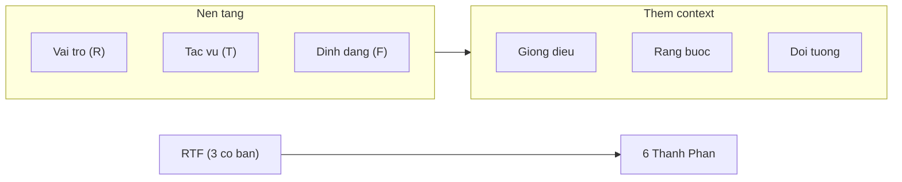

# Session 1: AI Nghi Nhu The Nao + Agent Dau Tien

---
## Slide 1: [Khong co tieu de -- Mo dau bang Live Demo]

[Man hinh: Claude Cowork da mo san. Facilitator paste don hang Google Vietnam]

> Don hang: TNHH Google Vietnam, 9 Dinh Tien Hoang TP.HCM
> Dich vu: Lam mobile 10tr + Design nha 5tr, VAT 8%, 10 ngay

**Speaker Notes:** "Xin chao! Khong slide gioi thieu. Toi muon cho ban thay 1 thu ngay." Paste don hang, go brief ngan: "Doc thong tin don hang nay va tao ban nhap hop dong dich vu hoan chinh." Agent chay 20-30 giay. Mo output. Khong giai thich -- de lop phan ung.

---
## Slide 2: Poll #1 -- Phan ung dau tien

**ZOOM POLL:**

"Phan ung dau tien cua ban?"

- A. An tuong
- B. Khong chac chinh xac
- C. Muon thu ngay
- D. Da biet roi

**Speaker Notes:** Doc ket qua nhanh. Neu >50% chon D, tang pace, bot giai thich co ban. Chuyen tiep: "Vay AI vua lam gi? No KHONG hieu hop dong. No du doan tu tiep theo."

---
## Slide 3: AI Hoat Dong The Nao? -- 3 Khai Niem Nen Tang

```
+---------------------------+
|   MAY DU DOAN TU          |
|   Autocomplete x ty lan   |
|   Da "doc" ngan hop dong  |
+---------------------------+
         |
+---------------------------+
|   CUA SO NGU CANH         |
|   AI nho cuoc tro chuyen  |
|   nhung co gioi han (RAM) |
+---------------------------+
         |
+---------------------------+
|   HALLUCINATION            |
|   AI tu tin ke ca khi sai |
|   Du doan tu hop ly,      |
|   KHONG kiem tra su that  |
+---------------------------+
```

> "Hay nghi Claude la NHAN VIEN MOI XUAT SAC -- rat gioi nhung chua biet quy trinh cong ty ban." (Anthropic official)

**Speaker Notes:** 3 khai niem, moi cai 2 phut. Ngon ngu doi thuong. "AI khong hieu nhu nguoi, nhung du doan rat gioi." Mental model "nhan vien moi xuat sac" dung xuyen suot khoa hoc -- moi ky thuat prompt deu frame thanh "cach brief nhan vien moi ro hon".

---
## Slide 4: Chat Activity

**Go vao Zoom chat:**

> "Neu AI la nhan vien moi, ban se giao viec gi dau tien?"

*(30 giay -- facilitator doc 3 cau thu vi)*

**Speaker Notes:** Chon 1 cau tu manager, 1 tu marketer, 1 tu teacher neu co. Ket noi: "Tat ca nhung viec nay deu lam tot hon khi ban brief ro rang hon."

---
## Slide 5: Hallucination Demo -- Chung Minh Ngay

**Demo truc tiep:** Hoi Claude ve don hang vua roi:

> "Tong gia tri hop dong sau thue, phi shipping, va tien phat tre han la bao nhieu?"

*(Don hang KHONG co phi shipping va phat tre han -- AI se bia)*

**Chien luoc:** Tam giac hoa nguon -- kiem tra 2+ nguon doc lap

```
       AI Output
      /         \
     /           \
Tai lieu goc --- Kien thuc chuyen mon
```

**Speaker Notes:** "Day la ly do ban can biet chu de du de danh gia AI." Dung vi du kinh doanh an toan. KHONG dung vi du chinh tri. "AI bia rat tu tin -- nen LUON kiem tra so lieu."

---
## Slide 6: Poll #2 -- Thoi quen kiem chung

**ZOOM POLL:**

"Ban se kiem tra ket qua AI truoc khi dung khong?"

- A. Luon luon
- B. Thinh thoang
- C. Hiem khi
- D. Chua nghi den

**Speaker Notes:** Muc tieu: 100% chon A sau khoa hoc. Neu nhieu C/D: "Do la ly do chung ta can brief ro -- giam rui ro bia."

---
## Slide 7: RTF -- Brief Nhan Vien Moi

"De brief nhan vien moi tot, ban can gi?"

| Thanh phan | Y nghia | Vi du |
|-----------|---------|-------|
| **R** -- Vai tro | AI dong vai gi | "Chuyen gia hop dong" |
| **T** -- Tac vu | Lam gi cu the | "Trich xuat 5 diem chinh" |
| **F** -- Dinh dang | Ket qua trong the nao | "Bullet points, moi diem 1 cau" |

**Demo:** Prompt don gian (slide 1) vs. Prompt RTF -- so sanh ket qua

**Speaker Notes:** "Neu ban giao viec cho nhan vien moi: tao hop dong tu don hang -- ban se noi gi?" Thu 3-4 y kien qua chat. Tong hop len 3 yeu to: Vai tro + Tac vu + Dinh dang. "Day chinh xac la cach brief AI -- RTF." RTF emerge tu logic delegation, khong phai "meo prompt".

---
## Slide 8: Poll #3 -- So sanh ket qua RTF

**ZOOM POLL:**

"Ket qua prompt RTF co tot hon khong?"

- A. Tot hon nhieu
- B. Tot hon chut
- C. Giong nhau
- D. Te hon

**Speaker Notes:** Thuong 70%+ chon A. Neu co nguoi chon D, hoi cu the -- co hoi coaching.

---
## Slide 9: 6 Thanh Phan -- Mo Rong Brief Cho Nhan Vien Moi



> "Nhan vien moi se lam tot hon neu biet them: viet cho ai doc, khong duoc lam gi, ai se dung ket qua."
> "6 thanh phan = bo cong cu brief day du. Khong can dung het moi lan."

**Speaker Notes:** Demo ngay: prompt 6 thanh phan cho tac vu hop dong. Chay, doc ket qua. Frame: "Ban dang hoc cach giao viec cho AI, khong phai hoc ky thuat prompt."

---
## Slide 10: Huong Dan Thuc Hanh -- Setup Cowork

**Buoc thuc hien:**
1. Mo trinh duyet -> Cowork
2. Dang nhap / tao account
3. Tao project moi
4. Paste don hang mau (handout co san)

**Speaker Notes:** Chia se man hinh, lam tung buoc cham. TA ho tro qua chat neu ai gap loi. Danh 5 phut cho buoc nay. Hoc vien dung Cowork -- KHONG phai Claude.ai.

---
## Slide 11: Bai Tap 1 -- Brief Contract Agent (13 phut)

**Nhiem vu A (5 phut):** Viet brief RTF gui Cowork
- Vai tro: chuyen gia hop dong
- Tac vu: trich xuat 5 diem chinh
- Dinh dang: bullet points

**Nhiem vu B (6 phut):** Mo rong brief them 3 thanh phan
- Giong dieu: chuyen nghiep
- Rang buoc: theo luat VN, <200 tu
- Doi tuong: GD se ky

**Nhiem vu C -- neu xong som:** Them vi du mau output (few-shot)
> "Cho nhan vien moi xem mau truoc khi lam"

**Speaker Notes:** 3 nhiem vu tiered: Foundation (A) -> Extension (B) -> Challenge (C). Cho phep pace khac nhau. Khi few-shot emerge: frame la "cho nhan vien moi xem mau" -- KHONG goi la "ky thuat few-shot".

---
## Slide 12: Bai Tap 2 -- Brief Nang Cao (8 phut)

Dung brief Nhiem vu B. Them dong:

> "Truoc khi tao hop dong, hay liet ke 3 rui ro phap ly tiem an tu thong tin don hang nay va giai thich cach xu ly."

So sanh: ket qua co sau hon khong?

> "Yeu cau nhan vien suy nghi truoc khi hanh dong" = chain-of-thought

**Speaker Notes:** Frame la "yeu cau suy nghi truoc khi hanh dong" -- KHONG goi la "chain-of-thought prompting". Poll #4 ngay sau: "Brief nang cao co cai thien ket qua?" (Co ro ret / Co chut / Khong doi / Kho so sanh)

---
## Slide 13: Bai Tap 3 -- Tac Vu Cong Viec Thuc Te (15 phut)

**Chon 1 viec phai lam trong tuan nay:**

| Level | Yeu cau |
|-------|---------|
| Foundation | Brief RTF, gui Cowork, danh gia output |
| Extension | Brief 6 thanh phan + 1 vi du mau |
| Challenge | 6 thanh phan + suy luan + 2 vi du mau |

**Danh gia theo 3 tieu chi:**
1. Dung noi dung?
2. Dung dinh dang?
3. Dung duoc ngay?

**Speaker Notes:** Chuyen tu hop dong sang tac vu ca nhan. 3 nguoi tinh nguyen chia se man hinh. Lop phan hoi: "Brief nay thieu gi de nhan vien moi hieu ro hon?"

---
## Slide 14: 3 Takeaway + Homework

**3 dieu mang ve:**
1. AI = nhan vien moi xuat sac -- brief ro = ket qua tot
2. Luon kiem chung -- AI tu tin ke ca khi sai
3. Brief co cau truc (RTF+) tot hon gap nhieu lan brief chung chung

**Bai tap ve nha (20-25 phut):**
- Tao "Brief Library" ca nhan: 5 brief cho 5 tac vu thuong xuyen
- Moi brief dung it nhat RTF + 1 thanh phan them
- 1 brief lien quan xu ly tai lieu
- Chay moi brief tren Cowork, ghi ket qua

**Preview Session 2:** "Hom nay ban giao 1 brief moi lan. Buoi toi: ban se thiet ke workflow -- AI tu lap ke hoach, phan chia, thuc hien nhieu buoc."

**Speaker Notes:** Nhan manh: "Ket thuc buoi hom nay, ban da hoan thanh it nhat 1 viec THAT bang AI. Khong xem demo -- viec that cua ban."
