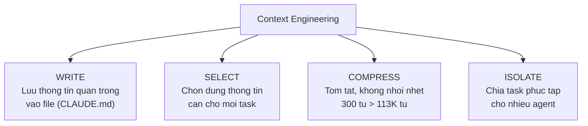

# Session 3: Context Engineering + Claude Code

---
## Slide 1: Retrieval Warm-up

**Khong mo ghi chu. Go chat:**

> "3-Question Framework cua buoi truoc gom nhung cau gi?"

*(Retrieval practice -- keo tu tri nho)*

1 nguoi chia se brief + ket qua Cowork tu homework.

**Speaker Notes:** 5 phut. 3 cau: Done trong nhu the nao? Claude khong the suy ra dieu gi? Rang buoc gi? Ai nho duoc ca 3 -> reactions.

---
## Slide 2: Poll #1 -- Trang thai Claude Code

**ZOOM POLL:**

"Ban da cai Claude Code chua?"

- A. Cai roi, test ok
- B. Cai roi, chua test
- C. Chua cai
- D. Khong biet cach

**Speaker Notes:** Neu >40% chon C/D -> danh 15 phut setup trong Block B, rut Bai tap 2. Dieu chinh pace theo ket qua poll.

---
## Slide 3: Context Engineering -- Thiet Ke So Tay Nhan Vien

**Phep so sanh:**

| Brief tung task | So tay nhan vien |
|----------------|-----------------|
| Moi lan phai noi lai | Viet 1 lan, dung mai |
| AI khong nho phien truoc | AI doc dau tien, nho suot |
| Ket qua khong nhat quan | Output dung phong cach |

> **Context Engineering = thiet ke cach thong tin chay qua AI**
> "Khong phai viet prompt tot hon. Ma thiet ke MOI TRUONG de AI lam tot."

**Speaker Notes:** "Buoi 1 ban brief 1 viec. Buoi 2 brief 1 workflow. Bay gio cau hoi khac: lam sao de AI hieu CACH BAN LAM VIEC -- khong chi 1 task, ma moi task? Do la context engineering -- thiet ke so tay nhan vien cho AI."

---
## Slide 4: 4 Chien Luoc Context Engineering



**Speaker Notes:** 4 chien luoc tu Anthropic. Giai thich don gian: Write = ghi so tay. Select = mo dung trang. Compress = viet ngan gon. Isolate = phan cong nhom. "Focused 300 tokens > unfocused 113K tokens" -- "Neu ban dua nhan vien moi 200 trang so tay vs. 1 trang checklist ro rang -- cai nao ho theo tot hon?"

---
## Slide 5: Smart Zone -- AI Nho Gi?

```
+----------------------------------+
| SMART ZONE (~40%)                |
| CLAUDE.md, system instructions   |
| -> AI doc DAU TIEN               |
| -> Nho SUOT phien                |
| -> Recall cao                    |
+----------------------------------+
| WORKING ZONE (~60%)              |
| Cuoc tro chuyen, tool output     |
| -> Co the bi nen/mat             |
| -> Dung xong co the quen         |
+----------------------------------+
```

> **CLAUDE.md nam trong Smart Zone** -- vi tri quan trong nhat trong bo nho AI

**Speaker Notes:** "Smart Zone = kien thuc lau dai (ten ban, nghe nghiep). Working Zone = bo nho lam viec (so dien thoai vua nghe). CLAUDE.md nam trong Smart Zone -- AI giu no trong vung nho quan trong nhat."

---
## Slide 6: Demo -- Co vs Khong co CLAUDE.md

**Cung prompt, 2 ket qua khac nhau:**

| Khong co CLAUDE.md | Co CLAUDE.md |
|-------------------|-------------|
| Ket qua chung chung | Dung phong cach |
| Thieu context | Dung format |
| Phai sua nhieu | Dung duoc ngay |

**Speaker Notes:** Demo live tren Claude Code. Chay KHONG co CLAUDE.md -> ket qua generic. Chay CO CLAUDE.md -> ket qua dung phong cach. "Thay chua? Cung 1 cau hoi, ket qua khac hoan toan chi vi AI co 'so tay'."

---
## Slide 7: Chat Activity

**Go vao Zoom chat:**

> "Neu viet 'so tay nhan vien' cho AI trong cong viec cua ban, 3 quy tac quan trong nhat la gi?"

*(30 giay -- facilitator tong hop)*

**Speaker Notes:** Nhom cau tra loi: quy tac ve phong cach, noi dung, gioi han. "Tat ca nhung quy tac nay deu di vao CLAUDE.md."

---
## Slide 8: CLAUDE.md Anatomy -- WHY-WHAT-HOW

**Dissect contract-agent's CLAUDE.md:**

```
+------------------------------------------+
| WHY -- Muc dich                          |
| "Agent nay ton tai de tao hop dong       |
|  tu don hang"                            |
+------------------------------------------+
| WHAT -- Pham vi                          |
| LAM: doc order, fill template            |
| KHONG LAM: khong ky, khong sua gia       |
+------------------------------------------+
| HOW -- Workflow                          |
| B1. Doc file don hang                    |
| B2. Trich xuat thong tin                 |
| B3. Fill template hop dong               |
| B4. Kiem tra so lieu                     |
+------------------------------------------+
```

**3 anti-patterns:** Dung auto-generate | Dung bien AI thanh linter | Giu <300 dong

**Speaker Notes:** Mo CLAUDE.md contract-agent tren man hinh, phong to font. "Day chinh xac la nhung gi ban se tu viet." Few-shot woven: "Vi du output trong CLAUDE.md = cho nhan vien moi xem mau." CoT woven: "Workflow steps = yeu cau nhan vien suy nghi theo trinh tu."

---
## Slide 9: Poll #2 -- Phan nao quan trong nhat?

**ZOOM POLL:**

"Viet CLAUDE.md cho cong viec ban, phan nao quan trong nhat?"

- A. WHY (Muc dich)
- B. WHAT (Pham vi)
- C. HOW (Workflow)
- D. Ca 3 nhu nhau

**Speaker Notes:** Thao luan ngan. "WHY quyet dinh moi thu khac. Nhung HOW la phan AI dung de thuc thi."

---
## Slide 10: Demo -- Chay Contract-Agent Tren Claude Code

**Live demo tren terminal:**

```bash
cd contract-agent/
claude
# Claude Code doc CLAUDE.md tu dong
# Cung cap file don hang (prompt.md)
# Agent: doc template -> trich xuat -> tao hop dong
# Mo file output
```

> "Day la dieu ban se tu lam trong Block B."

**Speaker Notes:** Mo terminal, cd vao thu muc contract-agent. Chay Claude Code, cung cap file don hang. Claude Code doc CLAUDE.md -> doc template -> tao file hop dong output. Mo file cho lop thay. 5 phut demo.

---
## Slide 11: Setup Claude Code + Chay Contract-Agent

**Huong dan tung buoc:**
1. Mo terminal
2. Go `claude` -> xac nhan hoat dong
3. Download thu muc contract-agent (link trong chat)
4. `cd contract-agent/`
5. Test: "Hoi Claude Code: Ban la ai?"
6. Chay voi file don hang mau

**Danh gia output:**
- Thong tin chinh xac?
- Format dung template?
- Dung duoc ngay?

**Speaker Notes:** Setup la rui ro lon nhat. TA ho tro 1-1 qua chat. Neu hoc vien khong cai duoc Code -> cho xem facilitator demo, van lam bai tap viet CLAUDE.md tren Google Docs.

---
## Slide 12: Bai Tap 2 -- Doi Don Hang, Chay Lai

**Sua file don hang:**
- Them dich vu moi: "Tu van SEO: 8 trieu"
- Doi ten khach hang
- Chay lai contract-agent

**Kiem tra:** Output cap nhat dung khong?

> "Contract-agent xu ly input khac nhau deu giong nhau -- vi CLAUDE.md huong dan QUY TRINH, khong phai tung case."

**Speaker Notes:** Poll #3 ngay sau: "Ket qua contract-agent?" (Dung ngay duoc / Sua nho / Sua nhieu / Loi khong chay). Uu tien ho tro nhom "Loi".

---
## Slide 13: Bai Tap 3 -- Phac Thao CLAUDE.md Ca Nhan (17 phut)

**Template WHY-WHAT-HOW:**

| Buoc | Thoi gian | Lam gi |
|------|-----------|--------|
| 1 | 3 phut | Chon 1 tac vu lap lai. Viet WHY: "Agent nay ton tai de ___." |
| 2 | 4 phut | Viet WHAT: 3 viec AI lam, 2 viec KHONG lam |
| 3 | 5 phut | Viet HOW: 4-5 buoc workflow theo thu tu |
| 4 | 3 phut | Them 1 vi du output mong muon (few-shot) |
| 5 | 2 phut | Luu thanh CLAUDE.md. Test voi Claude Code |

**Speaker Notes:** 2-3 nguoi chia se ban nhap CLAUDE.md. Lop gop y: "Workflow nay du ro de AI tu lam chua? Thieu context gi?"

---
## Slide 14: 3 Takeaway + Homework

**3 dieu mang ve:**
1. Context Engineering > brief tung task -- thiet ke moi truong, khong chi viet prompt
2. CLAUDE.md nam trong Smart Zone -- AI doc dau tien, nho suot
3. WHY-WHAT-HOW = cau truc so tay nhan vien cho AI

**Bai tap ve nha (25 phut):**
- Hoan thien CLAUDE.md (WHY-WHAT-HOW day du + vi du output)
- Test: chay tac vu CO vs KHONG CO CLAUDE.md, ghi 3 khac biet
- Bat dau liet ke input -> output -> cac buoc cho SKILL.md (Session 4)

**Preview Session 4:** "Ban vua viet CLAUDE.md -- so tay cho AI. Buoi toi: ban se nang cap thanh SKILL.md -- quy trinh tai su dung. Va ket noi MCP tool de AI doc file truc tiep tu may."

**Speaker Notes:** Nhan manh chuyen doi: "Tu brief 1 task (S1) -> brief 1 project (S2) -> thiet ke moi truong (S3). Buoi toi: thiet ke quy trinh tai su dung (S4)."
