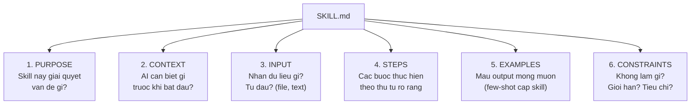

# Session 4: Thiet Ke Skill Dau Tien (Skill Design)

---
## Slide 1: Retrieval Warm-up

**Go chat: "4 chien luoc context engineering la gi?"**

*(Write / Select / Compress / Isolate -- retrieval practice)*

Homework debrief: "AI co khac khi co CLAUDE.md khong?"
-> 2-3 nguoi chia se ket qua so sanh CO/KHONG CLAUDE.md

**Speaker Notes:** 5 phut. Ai nho du 4 chien luoc -> reactions. Hoi cu the: "Khac o diem nao? Output chinh xac hon? Dung phong cach hon?"

---
## Slide 2: Poll #1 -- Trang thai CLAUDE.md

**ZOOM POLL:**

"CLAUDE.md cua ban co bao nhieu phan?"

- A. Chua co
- B. 1-2 phan
- C. 3 phan WHY-WHAT-HOW
- D. Day du + vi du

**Speaker Notes:** Neu nhieu A/B -> danh them thoi gian viet trong Block B. Neu da so C/D -> tap trung vao SKILL.md nang cao.

---
## Slide 3: Tu CLAUDE.md -> SKILL.md

| CLAUDE.md | SKILL.md |
|-----------|----------|
| So tay chung (cong ty) | Quy trinh cu the (1 loai tac vu) |
| Ap dung cho moi task | Ap dung cho 1 loai task |
| WHY-WHAT-HOW | 6 phan chi tiet |
| Viet 1 lan | Chay 100 lan |

> "CLAUDE.md = so tay cong ty. SKILL.md = huong dan quy trinh cu the."

**Speaker Notes:** "Session 3 ban hoc thiet ke moi truong (CLAUDE.md). Session 4: thiet ke QUY TRINH tai su dung (SKILL.md). Tu 'AI biet cach lam viec cua ban' sang 'AI biet cach lam 1 viec CU THE tot nhat.'"

---
## Slide 4: SKILL.md Anatomy -- 6 Phan



**Speaker Notes:** Demo: chay contract-agent SKILL.md tren Claude Code, show output. "6 phan nay = tat ca nhung gi AI can de lam 1 viec cu the tot. Steps = chain-of-thought o cap he thong. Examples = few-shot o cap skill. Constraints = structured output rules. Ban da biet tat ca tu S1 -- gio ap dung o quy mo lon hon."

---
## Slide 5: Workflow Decomposition -- 4 Buoc Phan Tich

```
Quy trinh hien tai (tat ca cac buoc)
          |
    +-----+-----+
    |             |
AI lam duoc    AI CHUA lam duoc
(xu ly van ban,  (phan quyet phuc tap,
 tong hop,       quyet dinh nhay cam,
 format,         quan he con nguoi)
 so sanh)
```

**Vi du: "Soan bao cao phan tich doi thu"**
1. Thu thap thong tin doi thu -> AI
2. Phan tich diem manh/yeu -> AI
3. So sanh voi cong ty minh -> AI
4. Tao slide bao cao -> AI
5. **Quyet dinh chien luoc** -> NGUOI
6. **Trinh bay cho board** -> NGUOI

**Speaker Notes:** "Liet ke TAT CA buoc. Danh dau buoc AI lam duoc. Loai bo buoc can phan doan cua nguoi. Phan con lai = SKILL.md cua ban."

---
## Slide 6: 3 Vi Du Agentic Workflow Thuc Te

| Workflow | Input | Steps | Output |
|----------|-------|-------|--------|
| **HR Onboarding** | Job desc + handbook (PDF) | Trich xuat -> cross-ref -> draft | Welcome Guide + email |
| **Expense Audit** | Expense reports + policy | Doc policy -> check tung expense -> flag | Audit report + approvals |
| **Content Writing** | Brief + outline | Review outline -> suggest -> critique -> research | Draft + gap analysis |

> "3 workflow khac nhau, cung cau truc SKILL.md: Input -> Steps -> Output + Constraints"

**Speaker Notes:** Chon vi du relevant voi audience: HR -> managers, Expense -> finance/admin, Content -> marketers/teachers. De ho thay minh trong 1 vi du.

---
## Slide 7: 3 Loi Thuong Gap SKILL.md

| Loi | Vi du sai | Cach sua |
|-----|----------|---------|
| Qua chung chung | "Viet bao cao" | "Viet bao cao 3 phan: tom tat 2 cau, phan tich 5 bullets, de xuat 3 hanh dong" |
| Qua cung nhac | Micro-manage tung cau chu | Cho AI linh hoat trong framework |
| Thieu tieu chi | AI khong biet "du tot" = gi | Them: "Output dat chuan khi co X, Y, Z" |

**Speaker Notes:** "3 loi nay rat pho bien. Qua chung chung = AI doan. Qua cung nhac = AI khong linh hoat. Thieu tieu chi = ban khong biet danh gia." 3 phut.

---
## Slide 8: MCP -- O Cam Dien Chuan Quoc Te

```
+------------------+
|    Claude Code    |
+--------+---------+
         |
    +----+----+
    |   MCP   |  = O cam dien chuan
    +----+----+
         |
+--------+--------+--------+
|        |        |        |
File   Web     Database  API
System Search           khac
```

> "MCP = o cam dien chuan quoc te. Laptop nao cung cam duoc. Tool nao cung ket noi duoc voi AI."

**Demo:** Ket noi filesystem MCP -> Claude Code doc file .md truc tiep tu may, khong copy-paste.

**Speaker Notes:** Demo nhanh 2 phut -- du thay value. "Thay khong? Khong can copy-paste nua. AI doc file truc tiep." Chi tiet ket noi trong Block B.

---
## Slide 9: Bai Tap 1 -- Viet SKILL.md (15 phut)

**Dung tac vu da chon tu homework S3:**

| Buoc | Thoi gian | Lam gi |
|------|-----------|--------|
| 1 | 3 phut | Workflow Decomposition -- liet ke buoc, danh dau buoc AI lam duoc |
| 2 | 4 phut | Viet Purpose + Context + Input |
| 3 | 4 phut | Viet Steps (it nhat 4 buoc) |
| 4 | 2 phut | Viet 1 Example output (few-shot) |
| 5 | 2 phut | Viet Constraints + tieu chi chat luong |

**Speaker Notes:** Poll checkpoint sau bai tap: "Ban dang o dau?" (Dang viet / Viet xong, chuan bi test / Test roi, dang sua / Gap kho, can giup). Ho tro nhom "Gap kho".

---
## Slide 10: Bai Tap 2 -- Ket Noi MCP + Test (8 phut)

**Huong dan tung buoc:**
1. Ket noi filesystem MCP (slide huong dan chi tiet)
2. Chay SKILL.md voi Claude Code
3. AI doc file input tu may qua MCP (khong copy-paste)
4. Danh gia output theo tieu chi chat luong da viet

*Neu khong ket noi duoc MCP: van test SKILL.md bang cach paste input thu cong.*

**Speaker Notes:** Poll #3 sau: "MCP filesystem hoat dong khong?" (Co, doc file ok / Co nhung partial / Loi / Chua thu). Ho tro nhom "Loi". Chat share: "Mo ta SKILL.md cua ban trong 1 cau: 'Skill nay giup [ai] lam [gi] bang cach [cach nao].'"

---
## Slide 11: Bai Tap 3 -- Iterate SKILL.md (15 phut)

**3 vong iterate:**
1. Chay SKILL.md lan 2 voi input KHAC
2. Danh gia: output co consistent khong? Tieu chi dat chua?
3. Sua SKILL.md: them vi du thu 2, cu the hoa constraints, them edge case
4. Chay lan 3, so sanh v1 vs v3

> "Skill tot = skill da qua 3+ vong iterate."

**Speaker Notes:** 2-3 nguoi chia se SKILL.md + output. Lop binh luan: "SKILL.md nay co phan nao dac biet hieu qua? Thieu gi?"

---
## Slide 12: 3 Takeaway + Homework

**3 dieu mang ve:**
1. SKILL.md = quy trinh tai su dung -- viet 1 lan, chay 100 lan
2. Workflow Decomposition: liet ke buoc -> chon buoc AI lam -> viet SKILL.md
3. MCP = mo rong kha nang AI bang ket noi cong cu

**Bai tap ve nha (30 phut):**
- Hoan thien SKILL.md (day du 6 phan, it nhat 2 vi du output)
- Test voi 2 input khac nhau -- xac nhan skill hoat dong consistent
- Iterate it nhat 1 lan nua
- Chuan bi trinh bay 3 phut: Van de -> Demo -> Ket qua

**Preview Session 5:** "Buoi cuoi: hoan thien SKILL.md, test chuyen sau, va trinh bay 3 phut truoc lop -- demo live tren may. Skill tot nhat se duoc vote!"

**Speaker Notes:** "Ban dang tro thanh nguoi thiet ke AI workflow. Khong chi dung AI -- ma thiet ke cach AI lam viec cho ban."
