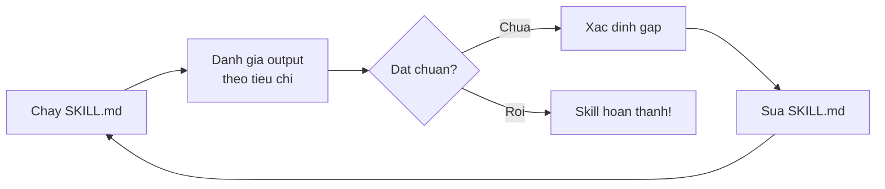

# Session 5: Build, Test, Trinh Bay (Capstone)

---
## Slide 1: Hanh Trinh 5 Buoi

```
S1              S2              S3              S4              S5
AI + Brief      Uy Quyen        Context         Skill           Build &
Dau Tien        Cho Agent       Engineering     Design          Trinh Bay
                                + Code          + MCP
   |               |               |               |               |
   v               v               v               v               v
Brief 1 task -> Brief 1 project -> Thiet ke     -> Quy trinh   -> Tai san
   RTF+6          4 phan           moi truong      tai su dung     AI rieng
                                   CLAUDE.md       SKILL.md        cua ban
```

> "Hom nay ban ve nha voi 1 skill TU VIET -- tai san AI tai su dung, khong phai chat 1 lan bo."

**Speaker Notes:** "5 buoi, 1 hanh trinh. Tu brief nhan vien moi -> thiet ke AI workflow ca nhan. Hom nay la buoi cuoi -- ban xay, test, va trinh bay skill cua minh."

---
## Slide 2: Poll #1 -- Trang thai SKILL.md

**ZOOM POLL:**

"SKILL.md ban nhap co bao nhieu buoc?"

- A. 1-3
- B. 4-6
- C. 7-10
- D. Chua co

**Speaker Notes:** "Chua co" can ho tro uu tien trong Block B. Phan nhom: D can template + 1-1, A-C co the tu lam.

---
## Slide 3: SKILL.md Review -- Tot vs Kem

| Tieu chi | SKILL.md KEM | SKILL.md TOT |
|----------|-------------|-------------|
| Purpose | "Viet bao cao" | "Tao bao cao phan tich doi thu hang thang tu du lieu ban hang" |
| Steps | 2 buoc mo ho | 5 buoc cu the, co thu tu |
| Examples | Khong co | 2 vi du output chi tiet |
| Constraints | Khong co | "Duoi 2 trang, co bang so sanh, khong bia so lieu" |

> "Skill kem = AI doan. Skill tot = AI biet chinh xac can lam gi."

**Speaker Notes:** Chuan bi 2 file mau truoc. "Kem" = 3 dong chung chung. "Tot" = 6 phan day du. Lop nhan dien 3 khac biet chinh.

---
## Slide 4: Test & Iterate Loop



**Demo:** Facilitator chay skill mau -> output thieu 1 phan -> sua SKILL.md them constraint -> chay lai -> output day du.

> "Iterate la ky nang cot loi -- skill chua bao gio hoan hao lan dau."

**Speaker Notes:** Demo live 5 phut. "Thay khong? Lan 1 thieu. Sua 1 dong. Lan 2 day du. Do la iterate -- khong phai loi, ma la quy trinh."

---
## Slide 5: Advanced Patterns (Tuy chon)

**3 nac tiep theo (khong bat buoc):**

| Pattern | Mo ta | Vi du |
|---------|-------|-------|
| Multi-skill stacking | Load nhieu skill cung luc | "Phan tich doi thu" + "Viet bao cao" = pipeline |
| Sub-agent | 1 skill goi sub-agent | 50 file xu ly song song |
| CLAUDE.md + SKILL.md ecosystem | Quy tac chung + quy trinh cu the | AI tu chon skill phu hop |

> "Day la nac tiep -- ban khong can lam ngay, nhung biet no ton tai."

**Speaker Notes:** 5-7 phut, chi gioi thieu. Neu thoi gian eo hep, cat phan nay. Inspiration, khong bat buoc.

---
## Slide 6: Rubric Trinh Bay -- 4 Tieu Chi

| Tieu chi | Mo ta | Diem |
|----------|-------|------|
| **Van de** | Ro rang: ai gap van de gi, mat bao lau truoc day? | /25 |
| **Demo** | Skill chay duoc, khong loi, output hien tren man hinh | /25 |
| **Ket qua** | Output dung duoc ngay? Tiet kiem bao phut? | /25 |
| **Trinh bay** | Mach lac, dung 3 phut, tu tin | /25 |

**Cau truc bat buoc:**
- 30 giay -- Van de
- 90 giay -- Demo
- 60 giay -- Ket qua

**Speaker Notes:** Phat rubric qua handout hoac chat link. Hoc vien can nhin khi danh gia bai trinh bay cua nhau.

---
## Slide 7: Workshop -- Hoan Thien SKILL.md (15 phut)

**Dua tren homework:**

1. Hoan thien 6 phan SKILL.md
2. Facilitator "di vong quanh" qua chat: "Ban dang viet skill gi? Gap kho o dau?"
3. Neu stuck: quay lai 4-step Workflow Decomposition tu S4
4. Nguoi xong som giup nguoi dang viet (peer mentoring)

**Poll checkpoint:** "Ban o dau?" (Dang viet / Dang test / Dang sua sau test / Xong, chuan bi trinh bay!)

**Speaker Notes:** Ho tro 1-1 qua screen share neu can. "Xong" giup "Dang viet" = peer mentoring tu nhien.

---
## Slide 8: Test & Iterate (10 phut)

**Chay SKILL.md tren Claude Code:**

1. Test voi 2 input khac nhau
2. Danh gia output theo tieu chi chat luong (da viet trong SKILL.md)
3. Sua it nhat 1 vong
4. Ghi lai: before/after -- cu the sua gi dan den ket qua tot hon

**Chat:** "Mo ta skill 1 cau: 'Skill nay giup [ai] lam [gi] tot hon bang cach [cach nao].'"

**Speaker Notes:** Chon 2-3 cau tu chat, hoi them: "Demo se trong the nao?" Chuyen tiep sang Block C.

---
## Slide 9: Trinh Bay Skill -- 3 Phut Moi Nguoi

**Cau truc:**

```
[30 giay] VAN DE
"Truoc day, toi mat ___ phut de ___."

[90 giay] DEMO
Chay skill live tren man hinh

[60 giay] KET QUA
"Skill tao ra ___, tiet kiem ___ phut, chat luong ___."
```

**Sau moi bai:** 2 nguoi phan hoi theo rubric + facilitator binh luan

*>10 nguoi: 8 trinh bay live, con lai paste SKILL.md vao chat + mo ta 2 cau*

**Speaker Notes:** Target 7-8 bai trinh bay. Giu chac 3 phut/nguoi. Timer hien tren man hinh neu co the.

---
## Slide 10: Vote -- Skill Hay Nhat

**ZOOM POLL:**

- "Skill huu ich nhat"
- "Skill sang tao nhat"

Cong bo + ly do.

> "Skill duoc vote = da validated boi dong nghiep."

**Speaker Notes:** Cong bo nhanh, giai thich ly do. Tao cam giac thanh tuu.

---
## Slide 11: 5 Takeaway -- 1 Cau Moi Cai

1. **AI = nhan vien moi xuat sac** -- brief ro, kiem chung luon
2. **Agent > Chat** cho tac vu lap lai nhieu buoc -- 3-Question Framework
3. **Context Engineering** = thiet ke cach AI hieu cong viec ban 1 lan, dung mai -- CLAUDE.md
4. **SKILL.md = tai san tai su dung** -- khong phai chat 1 lan bo
5. **Iterate la ky nang cot loi** -- moi AI workflow cai thien qua refine

**Speaker Notes:** Doc tung takeaway, dung 1 giay. "5 dieu nay la tat ca nhung gi ban can nho. Phuc tap hon thi doc lai tai lieu. Nhung 5 cau nay la xương song."

---
## Slide 12: Spaced Practice -- Duy Tri Sau Khoa Hoc

```
Ngay 3:  Chay skill da tao voi tac vu thuc te
         |
Ngay 7:  Sua SKILL.md dua tren ket qua tuan dau
         |
Ngay 14: Viet SKILL.md thu 2 cho workflow khac
         |
Ngay 30: Review ca 2 skill, optimize
```

> "4 moc de ky nang thanh thoi quen."

**Tai lieu bo sung:** CLAUDE.md template | SKILL.md template | Contract-agent repo | Cong dong ho tro

**Speaker Notes:** "Khong phai hoc xong la xong. 4 moc nay giup chuyen tu 'biet' sang 'thanh thoi quen'. Ngay 3 la quan trong nhat -- lam ngay khi con nho."

---
## Slide 13: Poll Cuoi -- Tu Tin Muc Nao?

**ZOOM POLL:**

"Sau khoa hoc, ban tu tin dung AI agent trong cong viec o muc nao?"

- 1 -- Chua tu tin
- 2 -- It tu tin
- 3 -- Binh thuong
- 4 -- Tu tin
- 5 -- Rat tu tin

**Cam on + Ket thuc!**

**Speaker Notes:** Doc ket qua, cam on lop. "Cam on moi nguoi da danh 10 gio cung nhau. Ban da di tu 'AI la gi?' den 'toi thiet ke AI workflow rieng'. Do la 1 buoc nhay lon. Hen gap lai trong cong dong ho tro!"
